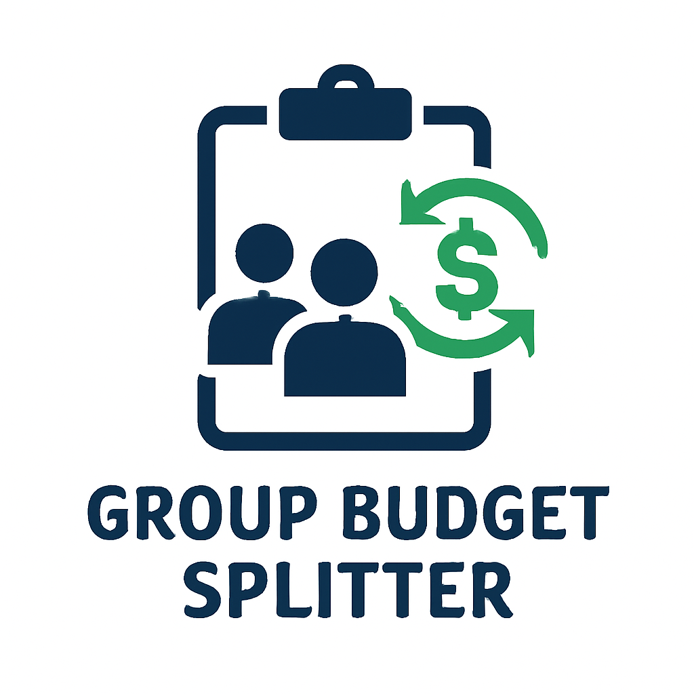
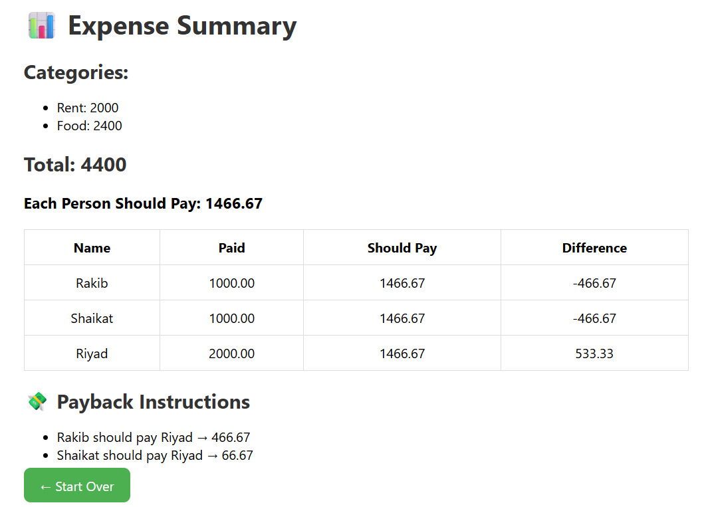

# <h1 align="center"> Group Budget Splitter </h1>

<p align="center">
  
</p>


## Group Budget Splitter – Django Project

A simple and professional Django web application to **split group expenses** fairly among multiple people. Whether it’s rent, food, or shared subscriptions — this tool helps calculate who owes whom, how much, and why.

---

### Features

* Input any number of **expense categories** (Rent, Food, etc.)
* Add unlimited **people** and how much they contributed
* Automatically calculate:

  * Total expenses
  * Equal share per person
  * Overpaid/underpaid amounts
  * Clear payback instructions (who owes whom and how much)
* Neat summary table with all calculations
* Clean and responsive UI (HTML, CSS, JS)
*  CSRF-protected forms using Django

---

### 🚀 Technologies Used

* Python 3
* Django 4.x
* HTML5 + CSS3
* Vanilla JavaScript
* Django Template Engine

---

### Screenshots
<p align="center">
  
</p>

---

### 🛠️ Setup Instructions

1. Clone the repository:

   ```
   git clone https://github.com/yourusername/group-budget-splitter.git
   cd group-budget-splitter
   ```

2. (Optional but recommended) Create a virtual environment:

   ```
   python -m venv venv
   source venv/bin/activate      # macOS/Linux
   venv\Scripts\activate         # Windows
   ```

3. Install dependencies:

   ```
   pip install -r requirements.txt
   ```

4. Run migrations:

   ```
   python manage.py migrate
   ```

5. Create a superuser (optional):

   ```
   python manage.py createsuperuser
   ```

6. Run the development server:

   ```
   python manage.py runserver
   ```

7. Open your browser and go to:

   ```
   http://localhost:8000/
   ```

---

### 📂 Project Structure

```
├── core/
│   ├── views.py
│   ├── forms.py
│   ├── models.py
│   ├── urls.py
│
├── templates/core/
│   ├── home.html
│   ├── result.html
│
├── static/css/
│   └── style.css
│
├── expenseshare/
│   ├── settings.py
│   ├── urls.py
│
├── manage.py
└── requirements.txt
```

---

### 🔧 Future Improvements (Ideas)

* Save user sessions and budgets
* Export results to PDF
* Visualize data with charts
* Add user login and dashboard
* Support multi-currency

---

### # Credits

Built with using Django by **Md Rakibul Hassan**

CSE Undergraduate | Backend Developer | Robotics & IoT Enthusiast

🔗 [LinkedIn](https://www.linkedin.com/in/md-rakibul-hassan-507b00308)

🐙 [GitHub](https://github.com/RR0327)

Designed to help users visualize complex data interactively.

# License

This project is open source and available under the MIT License.

---

### 📜 License

MIT License – free to use, modify, and distribute.

---
